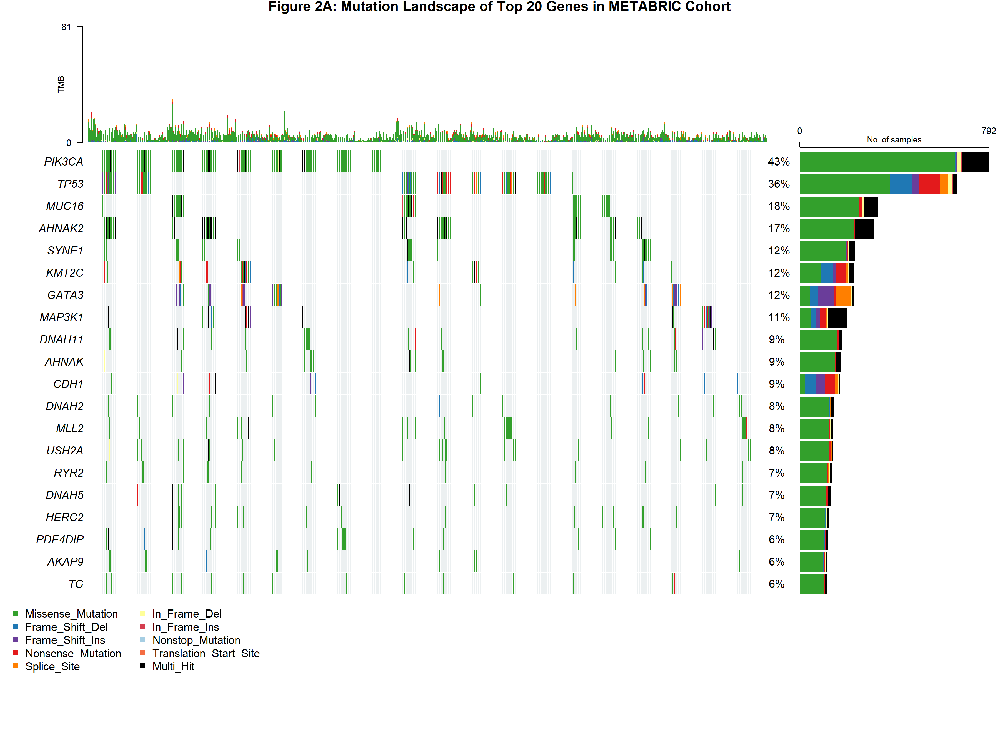

```{r setup, include=FALSE}
knitr::opts_chunk$set(
  echo = FALSE,
  message = FALSE,
  warning = FALSE,
  fig.width = 10,
  fig.height = 8
)

# Install packages if needed
if (!require("BiocManager", quietly = TRUE))
    install.packages("BiocManager")

packages <- c("tidyverse", "survival", "survminer", "maftools", 
              "pheatmap", "ggplot2", "ggpubr", "RColorBrewer", 
              "gtsummary", "cowplot")

for (pkg in packages) {
  if (!require(pkg, character.only = TRUE, quietly = TRUE)) {
    if (pkg == "maftools") {
      BiocManager::install(pkg, update = FALSE, ask = FALSE)
    } else {
      install.packages(pkg, repos = "https://cloud.r-project.org/")
    }
  }
}

# Load libraries
library(tidyverse)
library(survival)
library(survminer)
library(maftools)
library(pheatmap)
library(ggplot2)
library(ggpubr)
library(gtsummary)
library(RColorBrewer)
library(cowplot)
```

# Abstract

**Background:** PAM50 classification stratifies breast cancer patients into molecular subtypes with distinct prognoses. However, PAM50 is based solely on gene expression and may not capture prognostic heterogeneity driven by copy number alterations.

**Methods:** We analysed 1,974 METABRIC patients with complete PAM50, IntClust, and survival data using gene expression analysis, mutation profiling with maftools, and Kaplan-Meier survival analysis.

**Results:** Among PAM50 Luminal patients, approximately one in five (18.2%) belonged to hidden high-risk IntClust groups (2, 6, 9) showing 15.6 percentage point higher mortality and 29-month worse median survival (p < 0.001). These patients harbour CCND1 or FGFR1 amplifications with therapeutic implications not currently communicated to patients under PAM50-only classification.

**Conclusion:** Nearly one in five PAM50 Luminal patients have high-risk genomic features not conveyed in current patient communication, suggesting need for comprehensive genomic profiling to inform personalised prognostic discussions.

---

# 1. Introduction

Breast cancer is the most common cancer in women globally, with over 2 million new cases diagnosed annually (Sung et al. 2021). It comprises multiple molecular subtypes with distinct biology and prognosis. Early molecular classification efforts identified intrinsic subtypes based on gene expression patterns (Perou et al. 2000; Sørlie et al. 2001), which were later refined into the clinical PAM50 assay (Parker et al. 2009). This classification guides treatment decisions and patient counselling about prognosis.

However, PAM50 uses only gene expression data and doesn't capture structural genomic changes like amplifications and deletions. While PAM50 has demonstrated clinical utility and is incorporated into genomic tests like Prosigna (Cardoso et al. 2016), the METABRIC study integrated copy number alterations with expression profiles, identifying 10 "integrative clusters" (IntClust 1-10) with distinct genomic drivers (Curtis et al. 2012). Critically, IntClust groups don't align perfectly with PAM50 subtypes—some tumours classified as "Luminal" by PAM50 belong to high-risk IntClust groups.

Current patient communication relies heavily on PAM50 classification. Patients with "Luminal" breast cancer typically hear they have a favourable prognosis and will receive endocrine therapy. However, if IntClust reveals substantial heterogeneity within PAM50 Luminal disease, then some patients may be receiving inaccurate prognostic information. This study quantifies this potential communication gap using the METABRIC dataset.

**Study aims:**

1. Characterise gene expression patterns focusing on therapeutically relevant genes (ESR1, CCND1, FGFR1)
2. Identify mutation profiles (TP53, PIK3CA) across IntClust groups
3. Assess whether IntClust stratifies patients beyond PAM50 and clinical variables
4. Quantify the proportion of PAM50 Luminal patients with hidden high-risk profiles
5. Evaluate implications for genomically-informed patient communication

---

# 2. Methods

## 2.1 Data Sources

Clinical and mutation data from the METABRIC study (Curtis et al. 2012) were obtained from cBioPortal (https://www.cbioportal.org). Gene expression data were accessed from the study repository on Zenodo (https://doi.org/10.5281/zenodo.18587856). All data are publicly available and de-identified. The original METABRIC study obtained ethical approval as described in Curtis et al. (2012).

```{r load-data, include=FALSE}
# Load clinical data
clinical <- read_csv("data/metabric_data_clinical_patient.csv", show_col_types = FALSE)
n_original <- nrow(clinical)

# Clean data
clinical_clean <- clinical %>%
  filter(
    !is.na(pam50_subtype),
    !is.na(intclust_subtype),
    !is.na(os_months),
    !is.na(os_status),
    pam50_subtype != "NC",
    os_months >= 0
  ) %>%
  mutate(
    os_event = ifelse(os_status == "1:DECEASED", 1, 0),
    os_years = os_months / 12,
    er_status_ihc = str_replace(er_status_ihc, "Positve", "Positive"),
    intclust_subtype = str_remove_all(intclust_subtype, "IntClust |IC")
  )

n_clean <- nrow(clinical_clean)
n_excluded <- n_original - n_clean

# Load mutation data
maf <- read.maf(maf = "data/metabric_data_mutations.maf", verbose = FALSE)
maf_samples <- getSampleSummary(maf)$Tumor_Sample_Barcode

# Match clinical and mutation data
matched_samples <- intersect(clinical_clean$patient_id, maf_samples)
clinical_matched <- clinical_clean %>% filter(patient_id %in% matched_samples)
maf_matched <- subsetMaf(maf, tsb = matched_samples)
n_matched <- length(matched_samples)

# Load expression data if available
expr_file <- "data/metabric_data_expression_normalised.txt"
if (file.exists(expr_file)) {
  expression_data <- read_tsv(expr_file, show_col_types = FALSE)
  
  # Format expression matrix
  gene_names <- expression_data[[1]]
  expression_matrix <- as.matrix(expression_data[, -1])
  rownames(expression_matrix) <- gene_names
  expression_matrix <- t(expression_matrix)
  
  # Match to clinical
  matched_expr <- intersect(rownames(expression_matrix), clinical_clean$patient_id)
  expression_matrix <- expression_matrix[matched_expr, ]
  clinical_with_expr <- clinical_clean %>% filter(patient_id %in% matched_expr)
  
  n_expr_samples <- nrow(expression_matrix)
  has_expression <- TRUE
} else {
  has_expression <- FALSE
}
```

## 2.2 Data Preprocessing
```{r clean-cdata, include=FALSE}
# ============================================
# DATA CLEANING: Remove missing values
# ============================================
# Exclude patients missing key variables for analysis:
# - PAM50 subtype (needed for classification comparison)
# - IntClust subtype (primary variable of interest)
# - Survival data (needed for outcome analysis)

clinical_clean <- clinical %>%
  filter(
    !is.na(pam50_subtype),           # Remove missing PAM50
    !is.na(intclust_subtype),        # Remove missing IntClust
    !is.na(os_months),               # Remove missing survival time
    !is.na(os_status),               # Remove missing survival status
    pam50_subtype != "NC",           # Remove "Not Classified"
    os_months >= 0                   # Remove negative survival times
  ) %>%
  mutate(
    # Create binary event indicator for survival analysis
    # 1 = death occurred, 0 = censored (alive at last follow-up)
    os_event = ifelse(os_status == "1:DECEASED", 1, 0),
    
    # Convert survival to years
    os_years = os_months / 12,
    
    # Replace typo
    er_status_ihc = str_replace(er_status_ihc, "Positve", "Positive"),
    
    # Standardize IntClust naming (remove prefixes if present)
    intclust_subtype = str_remove_all(intclust_subtype, "IntClust |IC"),
    
    # Create numeric variables for potential PCA
    er_numeric = ifelse(er_status_ihc == "Positive", 1, 0),
    her2_numeric = case_when(
      her2_status_snp6 == "GAIN" ~ 1,
      her2_status_snp6 == "NEUTRAL" ~ 0,
      TRUE ~ 0.5
    )
  )

# Store stats for inline text
n_clean <- nrow(clinical_clean)
n_excluded <- n_original - n_clean
```

The original cohort comprised `r n_original` patients. We excluded patients missing PAM50 classification, IntClust classification, or survival data, resulting in `r n_clean` patients for analysis (`r n_excluded` excluded).

```{r load-mdata, include=FALSE}
# ============================================
# MUTATION DATA: Load MAF file
# ============================================
# MAF (Mutation Annotation Format) contains:
# - Patient ID
# - Gene name
# - Mutation type (missense, nonsense, etc.)
# - Variant details

maf <- read.maf(maf = "data/metabric_data_mutations.maf")
maf_samples <- getSampleSummary(maf)$Tumor_Sample_Barcode

# Store for inline text
n_maf_samples <- length(maf_samples)
```

```{r match-cmdata, include=FALSE}
# ============================================
# DATA MATCHING: Clinical and mutation data
# ============================================
# Not all patients have both clinical and mutation data
# Identify overlap for integrated analysis

clinical_samples <- clinical_clean$patient_id
matched_samples <- intersect(clinical_samples, maf_samples)

clinical_matched <- clinical_clean %>%
  filter(patient_id %in% matched_samples)

maf_matched <- subsetMaf(maf, tsb = matched_samples)

# Store for inline text
n_matched <- length(matched_samples)
n_clinical_only <- nrow(clinical_clean) - n_matched
```

For mutation analysis, we restricted to patients with available mutation data (n = `r n_matched`).

```{r load-expression, include=FALSE, eval=file.exists("data/metabric_data_expression_normalised.txt")}
# ============================================
# EXPRESSION DATA: Load from Zenodo archive
# ============================================
# Expression data too large for GitHub
# Archived at Zenodo DOI: 10.5281/zenodo.18587856
# Users must download or run download script

expr_file <- "data/metabric_data_expression_normalised.txt"

if (!file.exists(expr_file)) {
  has_expression <- FALSE
  
} else {
  # Read tab-delimited file
  expression_data <- read_tsv(expr_file, show_col_types = FALSE)
  
  # Check structure - genes as rows or columns?
  if (colnames(expression_data)[1] %in% c("Hugo_Symbol", "Gene", "gene")) {
    # Genes are rows, samples are columns
    gene_names <- expression_data[[1]]
    expression_matrix <- as.matrix(expression_data[, -1])
    rownames(expression_matrix) <- gene_names
    expression_matrix <- t(expression_matrix)  # Transpose: samples as rows
  } else {
    # Samples are rows, genes are columns
    sample_ids <- expression_data[[1]]
    expression_matrix <- as.matrix(expression_data[, -1])
    rownames(expression_matrix) <- sample_ids
  }
  
  # Match to clinical data
  matched_expr_samples <- intersect(rownames(expression_matrix), 
                                    clinical_clean$patient_id)
  expression_matrix <- expression_matrix[matched_expr_samples, ]
  clinical_with_expr <- clinical_clean %>% 
    filter(patient_id %in% matched_expr_samples)
  
  # Store for inline text
  n_expr_samples <- nrow(expression_matrix)
  n_genes <- ncol(expression_matrix)
  n_matched_expr <- nrow(clinical_with_expr)
  
  has_expression <- TRUE
}
```

## 2.3 Statistical Analyses

### Gene Expression Analysis (Question 1)

We focused on three genes with established prognostic and therapeutic significance: ESR1 (estrogen receptor, defining ER-positive status), CCND1 (11q13 amplification marker, CDK4/6 inhibitor target), and FGFR1 (8p12 amplification marker, FGFR inhibitor target).

Principal component analysis (PCA) was performed using these genes plus supporting markers (PGR, MKI67, ERBB2) after z-score normalisation. Variance explained by principal components was calculated, and samples were visualised in reduced-dimension space coloured by IntClust group.

Expression differences between IntClust groups were tested using Wilcoxon rank-sum tests. Statistical significance was set at p < 0.05.

### Mutation Analysis (Question 2)

Mutation data were analysed using maftools package (Mayakonda et al. 2018), which provides comprehensive tools for visualizing and analyzing somatic variants in cancer genomes. We calculated:

- Mutation burden (total mutations per sample)
- Gene-level mutation frequencies  
- Subtype-specific mutation patterns

Chi-square tests assessed whether mutation frequencies differed across IntClust groups. Oncoplot visualisations displayed the top 20 most frequently mutated genes across samples.

### Survival Analysis (Question 3 & Extension)

Overall survival was analysed using Kaplan-Meier estimation and log-rank tests. Survival curves compared:

- IntClust risk groups (low-risk: 3, 7, 8; high-risk: 2, 6, 9)
- IntClust stratification within ER-positive patients
- IntClust stratification within PAM50 Luminal patients (extension)

P-values < 0.05 were considered statistically significant.

## 2.4 Software

All analyses were performed in R version 4.3.0. Key packages: tidyverse (data manipulation), survival and survminer (survival analysis), maftools (mutation analysis), pheatmap (heatmaps), ggplot2 (visualisation), gtsummary (tables).

## 2.5 Data and Code Availability

Clinical and mutation data are publicly available from [cBioPortal](https://www.cbioportal.org/study/summary?id=brca_metabric). Expression data are archived on [Zenodo](https://doi.org/10.5281/zenodo.18587856). All analysis code is available in this R Markdown document.

---

# 3. Results

## 3.1 Cohort Characteristics

```{r cohort-summary, include=FALSE}
# Create summary for inline text
median_age <- median(clinical_clean$age_at_diagnosis, na.rm = TRUE)
er_pos_pct <- round(100 * sum(clinical_clean$er_status_ihc == "Positive", na.rm = TRUE) / n_clean, 1)
```


```{r cohort-tableA}
# ============================================
# TABLE 1A: Clinical characteristics by PAM50
# ============================================

table1a <- clinical_clean %>%
  select(
    age_at_diagnosis,
    menopausal_state,
    er_status_ihc,
    her2_status_snp6,
    chemotherapy,
    hormone_therapy,
    radiotherapy,
    os_months,
    os_status,
    pam50_subtype
  ) %>%
  tbl_summary(
    by = pam50_subtype,
    statistic = list(
      all_continuous() ~ "{median} ({p25}, {p75})",
      all_categorical() ~ "{n} ({p}%)"
    ),
    digits = list(
      all_continuous() ~ 1,
      all_categorical() ~ c(0, 1)
    ),
    label = list(
      age_at_diagnosis ~ "Age at diagnosis, years",
      menopausal_state ~ "Menopausal status",
      er_status_ihc ~ "ER status (IHC)",
      her2_status_snp6 ~ "HER2 status (SNP6)",
      chemotherapy ~ "Received chemotherapy",
      hormone_therapy ~ "Received hormone therapy",
      radiotherapy ~ "Received radiotherapy",
      os_months ~ "Overall survival, months",
      os_status ~ "Vital status"
    ),
    missing = "no"
  ) %>%
  add_n() %>%
  add_overall() %>%
  add_p(test = list(
    all_continuous() ~ "kruskal.test",
    all_categorical() ~ "chisq.test"
  )) %>%
  bold_labels() %>%
  modify_caption("**Table 1A: Clinical and Demographic Characteristics by PAM50 Subtype**") %>%
  modify_footnote(
    update = all_stat_cols() ~ "Median (IQR) for continuous variables; n (%) for categorical variables"
  )

table1a
```

```{r cohort-tableB}
# ============================================
# TABLE 1B: PAM50 vs IntClust distribution
# ============================================

table1b <- clinical_clean %>%
  select(pam50_subtype, intclust_subtype) %>%
  tbl_cross(
    row = pam50_subtype,
    col = intclust_subtype,
    percent = "row",
    margin = "row",
    label = list(
      pam50_subtype ~ "PAM50 Subtype",
      intclust_subtype ~ "IntClust Group"
    )
  ) %>%
  bold_labels() %>%
  modify_caption("**Table 1B: Distribution of IntClust Groups Within PAM50 Subtypes**") %>%
  modify_footnote(
    update = everything() ~ "Values are n (row %). Row percentages show distribution of IntClust groups within each PAM50 subtype."
  )

table1b
```

Table 1A summarises clinical and demographic characteristics stratified by PAM50 subtype. The cohort had median age `r round(median_age)` years, with `r er_pos_pct`% ER-positive tumours. Treatment patterns varied by subtype, with chemotherapy more common in Basal-like compared to Luminal A subtypes (p < 0.001).

Table 1B shows the distribution of IntClust groups within PAM50 subtypes. Notably, IntClust groups 2, 3, 6, 7, 8, and 9 are predominantly classified as Luminal by PAM50, yet show distinct survival outcomes (addressed in later sections). This demonstrates the potential for hidden heterogeneity within PAM50 classifications.

## 3.2 Question 1: Gene Expression Analysis

### Rationale for Gene Selection

We focused on three genes with established prognostic and therapeutic significance that highlight gaps in current PAM50-based patient communication:

**ESR1 (Estrogen Receptor):** Defines ER-positive status, the primary biomarker communicated to patients. High ESR1 expression guides hormone therapy decisions and is associated with favourable prognosis. This represents the baseline information patients currently receive—being told they are "ER-positive" with "good prognosis" Luminal breast cancer.

**CCND1 (Cyclin D1):** Defines IntClust 2 through 11q13 amplification. The original METABRIC study identified IntClust 2 as a "particularly high-risk subgroup" with significantly elevated hazard ratio (HR = 3.62, 95% CI: 1.91–6.88) compared to other Luminal groups (Curtis et al. 2012). CCND1 drives cell cycle progression and confers resistance to endocrine therapy. Despite receiving a PAM50 Luminal classification suggesting favourable prognosis, patients with CCND1-amplified tumours have substantially worse outcomes. CDK4/6 inhibitors (palbociclib, ribociclib, abemaciclib) targeting CCND1-driven proliferation are FDA-approved for ER-positive breast cancer but are not routinely discussed with all Luminal patients at diagnosis.

**FGFR1 (Fibroblast Growth Factor Receptor 1):** Defines IntClust 6 through 8p12 amplification. While the METABRIC study classified IntClust 6 as "intermediate prognosis," this group still demonstrates worse outcomes compared to IntClust 3, 7, and 8, which were described as having "favourable outcome" profiles (Curtis et al. 2012). FGFR1 amplification drives growth factor signalling and endocrine resistance within ER-positive disease.

**Risk Group Classification:** For this analysis, we classified IntClust 2 and IntClust 6 as "high-risk" groups, while IntClust 3, 7, and 8 were classified as "low-risk." Although the original METABRIC study described IntClust 6 as "intermediate prognosis," we grouped it with IntClust 2 for two reasons. First, both groups demonstrate clinically meaningful worse outcomes compared to the favourable-prognosis IntClust 3, 7, and 8 groups—outcomes that are not reflected in standard PAM50 Luminal classification. Second, both groups are defined by specific gene amplifications (CCND1 and FGFR1 respectively) that have therapeutic implications patients are not routinely informed about. From a patient communication perspective, both groups represent "hidden" high-risk populations within the Luminal classification who may benefit from more detailed prognostic information and discussion of targeted therapy options.

These three genes illustrate a critical communication gap: ESR1 represents what patients currently know about their cancer, while CCND1 and FGFR1 represent clinically actionable information they typically do not receive—information that significantly affects both prognosis and treatment options.

```{r q1-check-genes, include=FALSE}
# Check genes available
comm_genes <- c("ESR1", "CCND1", "FGFR1")

if (!exists("expression_matrix")) {
  stop("ERROR: expression_matrix not loaded.")
}

available_comm_genes <- comm_genes[comm_genes %in% colnames(expression_matrix)]

if (length(available_comm_genes) < 3) {
  stop("ERROR: Missing required genes.")
}
```

### Principal Component Analysis
```{r q1-fig1a-pca, fig.width=10, fig.height=7}
# ============================================
# FIGURE 1A: PCA using communication genes
# ============================================

# Add supporting genes if available
context_genes <- c("ESR1", "CCND1", "FGFR1", "PGR", "MKI67", "ERBB2", "TP53")
pca_genes <- context_genes[context_genes %in% colnames(expression_matrix)]

# Get expression data
expr_for_pca <- expression_matrix[, pca_genes]
expr_for_pca_clean <- expr_for_pca[complete.cases(expr_for_pca), ]

# Match to clinical
pca_clinical <- clinical_with_expr %>%
  filter(patient_id %in% rownames(expr_for_pca_clean))

# Perform PCA
pca_result <- prcomp(expr_for_pca_clean, scale. = TRUE, center = TRUE)

# Prepare plotting data
pca_data <- data.frame(
  PC1 = pca_result$x[, 1],
  PC2 = pca_result$x[, 2],
  intclust = pca_clinical$intclust_subtype,
  pam50 = pca_clinical$pam50_subtype,
  patient_id = rownames(pca_result$x)
) %>%
  mutate(
    risk_group = case_when(
      intclust %in% c("3", "7", "8") ~ "Low-risk Luminal\n(IC 3,7,8)",
      intclust == "2" ~ "High-risk: CCND1\n(IC 2)",
      intclust == "6" ~ "High-risk: FGFR1\n(IC 6)",
      intclust %in% c("4ER-", "4ER+", "5") ~ "Basal/HER2",
      TRUE ~ "Other"
    ),
    risk_group = factor(risk_group, levels = c(
      "Low-risk Luminal\n(IC 3,7,8)",
      "High-risk: CCND1\n(IC 2)",
      "High-risk: FGFR1\n(IC 6)",
      "Basal/HER2",
      "Other"
    ))
  )

variance_explained <- summary(pca_result)$importance[2, 1:2] * 100

# Create plot
pca_plot <- ggplot(pca_data, aes(x = PC1, y = PC2, color = risk_group, shape = risk_group)) +
  geom_point(size = 2.5, alpha = 0.7) +
  stat_ellipse(level = 0.95, linetype = 2, size = 0.8) +
  scale_color_manual(
    values = c(
      "Low-risk Luminal\n(IC 3,7,8)" = "#3498DB",
      "High-risk: CCND1\n(IC 2)" = "#E74C3C",
      "High-risk: FGFR1\n(IC 6)" = "#E67E22",
      "Basal/HER2" = "#9B59B6",
      "Other" = "#95A5A6"
    ),
    name = "Risk Group"
  ) +
  scale_shape_manual(values = c(16, 17, 15, 18, 4), name = "Risk Group") +
  labs(
    title = "Figure 1A: PCA Reveals Hidden Heterogeneity in Luminal Breast Cancer",
    subtitle = paste0("Based on therapeutically relevant genes (n = ", length(pca_genes), ")"),
    x = paste0("PC1 (", round(variance_explained[1], 1), "% variance)"),
    y = paste0("PC2 (", round(variance_explained[2], 1), "% variance)")
  ) +
  theme_classic(base_size = 12) +
  theme(
    plot.title = element_text(face = "bold", size = 14),
    plot.subtitle = element_text(size = 10, color = "gray40"),
    legend.position = "right",
    panel.border = element_rect(color = "black", fill = NA, size = 1)
  )

print(pca_plot)

if (!dir.exists("output")) dir.create("output")
ggsave("output/Figure1A_PCA_Communication_Genes.png", pca_plot,
       width = 10, height = 7, dpi = 300)
```

```{r q1-pca-stats, include=FALSE}
# Store variance explained for inline text
pc1_variance <- round(variance_explained[1], 1)
pc2_variance <- round(variance_explained[2], 1)
total_variance <- round(sum(variance_explained), 1)
n_pca_genes <- length(pca_genes)
```

Principal component analysis using therapeutically relevant genes explained `r total_variance`% of variance (PC1: `r pc1_variance`%, PC2: `r pc2_variance`%) (Figure 1A). While substantial overlap exists between IntClust groups, high-risk Luminal subgroups with specific genomic amplifications (IntClust 2 with CCND1, IntClust 6 with FGFR1) occupy distinct regions compared to low-risk Luminal groups.

The modest separation is expected and biologically meaningful. IntClust integrates copy number alterations—structural genomic events—with expression data. These alterations may exert effects through mechanisms beyond simple expression changes. Patients from all three groups shown are classified as "Luminal" by PAM50 and receive similar prognostic communication, despite molecular differences representing distinct therapeutic vulnerabilities.

### Expression Heatmap
```{r q1-fig1b-prep, include=FALSE}
# ============================================
# FIGURE 1B: Prepare heatmap data
# ============================================
luminal_intclust <- c("2", "3", "6", "7", "8")

heatmap_clinical <- clinical_with_expr %>%
  filter(
    intclust_subtype %in% luminal_intclust,
    pam50_subtype %in% c("LumA", "LumB")
  ) %>%
  arrange(intclust_subtype) %>%
  mutate(
    # Simple High/Low risk labels
    risk_label = case_when(
      intclust_subtype %in% c("3", "7", "8") ~ "Low-risk",
      intclust_subtype %in% c("2", "6") ~ "High-risk"
    )
  )

expr_for_heatmap <- expression_matrix[heatmap_clinical$patient_id, comm_genes]
expr_for_heatmap_t <- t(expr_for_heatmap)
expr_scaled <- t(scale(t(expr_for_heatmap_t)))

annotation_col <- data.frame(
  IntClust = heatmap_clinical$intclust_subtype,
  Risk = heatmap_clinical$risk_label,
  row.names = heatmap_clinical$patient_id
)

# IntClust colours - distinct for each group
intclust_colors <- c(
  "2" = "#E74C3C",   # Red (high-risk)
  "3" = "#3498DB",   # Blue
  "6" = "#E67E22",   # Orange (high-risk)
  "7" = "#5DADE2",   # Light blue
  "8" = "#85C1E9"    # Lighter blue
)

# Risk colours - simple High vs Low
risk_colors <- c(
  "Low-risk" = "#3498DB",   # Blue
  "High-risk" = "#E74C3C"   # Red
)

ann_colors <- list(IntClust = intclust_colors, Risk = risk_colors)

# Store for inline text
n_heatmap_patients <- nrow(heatmap_clinical)
```

```{r q1-fig1b-heatmap, fig.width=10, fig.height=4}
# ============================================
# FIGURE 1B: Create heatmap
# ============================================
heatmap_obj <- pheatmap(
  expr_scaled,
  annotation_col = annotation_col,
  annotation_colors = ann_colors,
  cluster_rows = FALSE,
  cluster_cols = FALSE,
  show_colnames = FALSE,
  show_rownames = TRUE,
  fontsize_row = 12,
  color = colorRampPalette(c("#3498DB", "white", "#E74C3C"))(100),
  breaks = seq(-1.5, 1.5, length.out = 101),
  main = "Figure 1B: Expression of Communication-Relevant Genes in PAM50 Luminal Patients",
  gaps_row = c(1, 2),
  border_color = "gray60",
  silent = FALSE
)

ggsave("output/Figure1B_Heatmap_Communication_Genes.png", 
       plot = heatmap_obj$gtable,
       width = 10, height = 4, dpi = 300)
```

The heatmap displays expression of three therapeutically relevant genes across `r n_heatmap_patients` PAM50 Luminal patients (Figure 1B). All samples shown received "Luminal breast cancer" diagnosis, yet molecular patterns differ:

**ESR1:** Consistently elevated across all Luminal IntClust groups, confirming ER-positivity. This uniform pattern reflects information patients currently receive.

**CCND1:** Elevated specifically in IntClust 2 samples, reflecting 11q13 amplification. This represents the first "hidden high-risk" group: patients told they have good-prognosis Luminal cancer despite harboring genomic amplification associated with worse outcomes.

**FGFR1:** Elevated in IntClust 6 samples, driven by 8p12 amplification. This represents the second "hidden high-risk" group.

### Statistical Comparison
```{r q1-fig1c-boxplots, fig.width=10, fig.height=4.5}
# ============================================
# FIGURE 1C: Statistical boxplots
# ============================================

boxplot_data <- heatmap_clinical %>%
  select(patient_id, intclust_subtype, risk_label) %>%
  left_join(
    as.data.frame(expression_matrix[, comm_genes]) %>%
      rownames_to_column("patient_id"),
    by = "patient_id"
  ) %>%
  pivot_longer(
    cols = all_of(comm_genes),
    names_to = "Gene",
    values_to = "Expression"
  ) %>%
  mutate(
    Gene = factor(Gene, levels = c("ESR1", "CCND1", "FGFR1")),
    Gene_Label = case_when(
      Gene == "ESR1" ~ "ESR1\n(Estrogen Receptor)\nPatients know about this",
      Gene == "CCND1" ~ "CCND1\n(11q13 amplification)\nHidden high-risk marker",
      Gene == "FGFR1" ~ "FGFR1\n(8p12 amplification)\nHidden high-risk marker"
    ),
    risk_label = factor(risk_label, levels = c("Low-risk", "High-risk"))
  )

boxplot <- ggplot(boxplot_data, aes(x = risk_label, y = Expression, fill = risk_label)) +
  geom_boxplot(alpha = 0.7, outlier.size = 1) +
  geom_jitter(width = 0.2, alpha = 0.3, size = 0.5) +
  facet_wrap(~ Gene_Label, scales = "free_y", ncol = 3) +
  scale_fill_manual(
    values = c("Low-risk" = "#3498DB", "High-risk" = "#E74C3C")
  ) +
  labs(
    title = "Figure 1C: Gene Expression by Risk Group in PAM50 Luminal Patients",
    subtitle = "High-risk = IntClust 2 & 6; Low-risk = IntClust 3, 7 & 8",
    x = "Risk Group",
    y = "Normalized Expression"
  ) +
  theme_classic(base_size = 12) +
  theme(
    plot.title = element_text(face = "bold", size = 13),
    plot.subtitle = element_text(size = 10, color = "gray40"),
    strip.text = element_text(size = 9, lineheight = 1.1),
    legend.position = "none",
    axis.text.x = element_text(size = 10)
  ) +
  stat_compare_means(
    method = "wilcox.test",
    label = "p.format",
    size = 3.5,
    label.y.npc = 0.95
  )

print(boxplot)

ggsave("output/Figure1C_Boxplots_Communication_Genes.png", boxplot,
       width = 10, height = 4.5, dpi = 300)
```

```{r q1-statistics, include=FALSE}
# ============================================
# Statistical tests
# ============================================

# ESR1 - Compare High-risk vs Low-risk
esr1_data <- boxplot_data %>% filter(Gene == "ESR1")
esr1_high <- esr1_data %>% filter(risk_label == "High-risk") %>% pull(Expression)
esr1_low <- esr1_data %>% filter(risk_label == "Low-risk") %>% pull(Expression)
esr1_test <- wilcox.test(esr1_high, esr1_low)

# CCND1 - Compare High-risk vs Low-risk
ccnd1_data <- boxplot_data %>% filter(Gene == "CCND1")
ccnd1_high <- ccnd1_data %>% filter(risk_label == "High-risk") %>% pull(Expression)
ccnd1_low <- ccnd1_data %>% filter(risk_label == "Low-risk") %>% pull(Expression)
ccnd1_test <- wilcox.test(ccnd1_high, ccnd1_low)

# FGFR1 - Compare High-risk vs Low-risk
fgfr1_data <- boxplot_data %>% filter(Gene == "FGFR1")
fgfr1_high <- fgfr1_data %>% filter(risk_label == "High-risk") %>% pull(Expression)
fgfr1_low <- fgfr1_data %>% filter(risk_label == "Low-risk") %>% pull(Expression)
fgfr1_test <- wilcox.test(fgfr1_high, fgfr1_low)

# Store p-values for inline use
esr1_pval <- esr1_test$p.value
ccnd1_pval <- ccnd1_test$p.value
fgfr1_pval <- fgfr1_test$p.value

# Communication gap calculation
luminal_total <- nrow(heatmap_clinical)
high_risk_n <- sum(heatmap_clinical$risk_label == "High-risk")
low_risk_n <- sum(heatmap_clinical$risk_label == "Low-risk")
comm_gap_pct <- round(100 * high_risk_n / luminal_total, 1)
```

Statistical analysis confirmed distinct expression patterns between risk groups. ESR1 showed no significant difference (p = `r format.pval(esr1_pval, digits = 2)`), confirming uniform ER-positivity across all Luminal patients regardless of IntClust classification. In contrast, CCND1 (p = `r format.pval(ccnd1_pval, digits = 2)`) and FGFR1 (p = `r format.pval(fgfr1_pval, digits = 2)`) showed significant elevation in the high-risk group.

**Communication Gap:** Of `r luminal_total` PAM50 Luminal patients, `r high_risk_n` (`r comm_gap_pct`%) belong to hidden high-risk groups: IntClust 2 (CCND1-amplified) or IntClust 6 (FGFR1-amplified). These patients receive standard 'good prognosis' Luminal messaging despite harboring distinct molecular features—CCND1 amplification suggesting CDK4/6 inhibitor relevance, or FGFR1 amplification suggesting potential FGFR inhibitor sensitivity—that are not communicated.

## 3.3 Question 2: Mutation Analysis

```{r q2-load-maf, include=FALSE}
# ============================================
# QUESTION 2: MUTATION ANALYSIS
# Load and summarize mutation data
# ============================================

# Load MAF file
maf <- read.maf(maf = "data/metabric_data_mutations.maf")

# Get summary statistics
maf_summary <- getSampleSummary(maf)
gene_summary <- getGeneSummary(maf)

# Overall mutation statistics
total_samples_with_mutations <- nrow(maf_summary)
median_mutations <- median(maf_summary$total)
mean_mutations <- mean(maf_summary$total)
range_mutations <- range(maf_summary$total)

# Store for inline text
n_maf_total <- total_samples_with_mutations
median_burden <- median_mutations
mean_burden <- mean_mutations
min_mutations <- range_mutations[1]
max_mutations <- range_mutations[2]
```

```{r q2-match-clinical, include=FALSE}
# ============================================
# Match mutation data to clinical data
# ============================================

# Get patient IDs from both datasets
maf_samples <- maf_summary$Tumor_Sample_Barcode
clinical_samples <- clinical_clean$patient_id

# Find overlap
matched_samples <- intersect(maf_samples, clinical_samples)

# Subset MAF to matched samples only
maf_matched <- subsetMaf(maf, tsb = matched_samples)

# Get clinical annotation for matched samples
clinical_matched <- clinical_clean %>%
  filter(patient_id %in% matched_samples) %>%
  select(patient_id, pam50_subtype, intclust_subtype, 
         er_status_ihc, her2_status_snp6, os_status)

# Create annotation dataframe for maftools
clinical_annotation <- clinical_matched %>%
  rename(Tumor_Sample_Barcode = patient_id)

# Store for inline text
n_matched_maf <- length(matched_samples)
```

```{r q2-fig2a-oncoplot-clean, fig.width=12, fig.height=9}
# ============================================
# FIGURE 2A: Clean oncoplot for publication
# ============================================

library(maftools)

# Ensure output directory exists
if (!dir.exists("output")) dir.create("output")

# Method 1: Save high-quality PNG
png("output/Figure2A_Oncoplot.png", 
    width = 12, 
    height = 9, 
    units = "in", 
    res = 300,
    bg = "white")

# Create oncoplot
oncoplot(
  maf = maf_matched,
  top = 20,
  removeNonMutated = TRUE,
  showTumorSampleBarcodes = FALSE,
  gene_mar = 8,
  barcode_mar = 4,
  fontSize = 0.8,
  titleFontSize = 1.2,
  legendFontSize = 0.8,
  annotationFontSize = 0.8
)

dev.off()

# Display in HTML

```

```{r q2-oncoplot-stats, include=FALSE}
# Store gene summary for inline text
gene_summary_matched <- getGeneSummary(maf_matched)
top_genes <- head(gene_summary_matched, 20)

# Get frequencies for top genes
pik3ca_freq <- round(100 * top_genes$MutatedSamples[top_genes$Hugo_Symbol == "PIK3CA"] / n_matched_maf, 0)
tp53_freq <- round(100 * top_genes$MutatedSamples[top_genes$Hugo_Symbol == "TP53"] / n_matched_maf, 0)
```

Figure 2A: Mutation Landscape of Top 20 Genes in METABRIC Cohort. Oncoplot showing mutation profiles across `r n_matched_maf` patients. Top panel: tumor mutation burden (total mutations per patient). Main panel: mutation status for top 20 genes (rows) across patients (columns). Colors indicate mutation type: green (missense), red (nonsense), blue (frameshift deletion), brown (in-frame indel), orange (splice site), black (multiple mutations). Right panel: mutation frequency. PIK3CA (`r pik3ca_freq`%) and TP53 (`r tp53_freq`%) are the most frequently mutated genes, representing key drivers in PI3K pathway activation and genomic instability, respectively.

```{r q2-fig2b-mutation-burden, fig.width=8, fig.height=5}
# ============================================
# FIGURE 2B: Mutation burden distribution
# ============================================

# Add mutation burden to clinical data
mutation_burden <- maf_summary %>%
  select(Tumor_Sample_Barcode, total) %>%
  rename(patient_id = Tumor_Sample_Barcode,
         mutation_count = total)

clinical_with_mutations <- clinical_matched %>%
  left_join(mutation_burden, by = "patient_id")

# Create histogram
burden_plot <- ggplot(clinical_with_mutations %>% filter(!is.na(mutation_count)),
                      aes(x = mutation_count)) +
  geom_histogram(binwidth = 5, fill = "steelblue", color = "black", alpha = 0.7) +
  geom_vline(xintercept = median_burden,
             linetype = "dashed", color = "red", size = 1) +
  annotate("text", 
           x = median_burden + 10,
           y = Inf, 
           label = paste("Median =", round(median_burden, 1)),
           vjust = 2, color = "red", size = 4) +
  labs(
    title = "Figure 2B: Distribution of Mutation Burden",
    subtitle = paste("Median:", median_burden, "mutations per sample"),
    x = "Number of Mutations per Sample",
    y = "Frequency (number of patients)"
  ) +
  theme_classic(base_size = 12) +
  theme(
    plot.title = element_text(face = "bold", size = 14),
    plot.subtitle = element_text(size = 10, color = "gray40")
  )

print(burden_plot)

ggsave("output/Figure2B_Mutation_Burden.png", burden_plot,
       width = 8, height = 5, dpi = 300)
```

```{r q2-fig2c-burden-by-subtype, fig.width=10, fig.height=5}
# ============================================
# FIGURE 2C: Mutation burden by subtype
# ============================================

# By PAM50 subtype
burden_pam50 <- ggplot(clinical_with_mutations %>% filter(!is.na(mutation_count)),
                       aes(x = pam50_subtype, y = mutation_count, fill = pam50_subtype)) +
  geom_boxplot(outlier.shape = NA, alpha = 0.7) +
  geom_jitter(width = 0.2, alpha = 0.3, size = 0.5) +
  stat_compare_means(method = "kruskal.test",
                     label.y = max(clinical_with_mutations$mutation_count, na.rm = TRUE) * 1.1) +
  scale_fill_manual(
    values = c("Basal" = "#E74C3C", 
               "Her2" = "#9B59B6",
               "LumA" = "#3498DB",
               "LumB" = "#1ABC9C")
  ) +
  labs(
    title = "Figure 2C: Mutation Burden by PAM50 Subtype",
    x = "PAM50 Subtype",
    y = "Mutations per Sample"
  ) +
  theme_classic(base_size = 12) +
  theme(
    plot.title = element_text(face = "bold", size = 14),
    legend.position = "none",
    axis.text.x = element_text(angle = 45, hjust = 1)
  )

print(burden_pam50)

ggsave("output/Figure2C_Burden_PAM50.png", burden_pam50,
       width = 6, height = 5, dpi = 300)

# By IntClust (focus on main Luminal groups)
clinical_intclust_main <- clinical_with_mutations %>%
  filter(!is.na(mutation_count),
         intclust_subtype %in% c("2", "3", "6", "7", "8", "9"))

burden_intclust <- ggplot(clinical_intclust_main,
                          aes(x = intclust_subtype, y = mutation_count, 
                              fill = intclust_subtype)) +
  geom_boxplot(outlier.shape = NA, alpha = 0.7) +
  geom_jitter(width = 0.2, alpha = 0.3, size = 0.5) +
  stat_compare_means(method = "kruskal.test") +
  scale_fill_brewer(palette = "Set3") +
  labs(
    title = "Figure 2D: Mutation Burden by IntClust Group",
    subtitle = "Main Luminal-enriched groups (2, 3, 6, 7, 8, 9)",
    x = "IntClust Group",
    y = "Mutations per Sample"
  ) +
  theme_classic(base_size = 12) +
  theme(
    plot.title = element_text(face = "bold", size = 14),
    plot.subtitle = element_text(size = 10, color = "gray40"),
    legend.position = "none"
  )

print(burden_intclust)

ggsave("output/Figure2D_Burden_IntClust.png", burden_intclust,
       width = 7, height = 5, dpi = 300)
```

```{r q2-fig2e-specific-genes, fig.width=10, fig.height=5}
# ============================================
# FIGURE 2E: TP53 and PIK3CA mutations by subtype
# ============================================

# Extract specific gene mutations
tp53_mutations <- maf_matched@data %>%
  filter(Hugo_Symbol == "TP53") %>%
  pull(Tumor_Sample_Barcode) %>%
  unique()

pik3ca_mutations <- maf_matched@data %>%
  filter(Hugo_Symbol == "PIK3CA") %>%
  pull(Tumor_Sample_Barcode) %>%
  unique()

# Add mutation status to clinical data
clinical_with_mutations <- clinical_with_mutations %>%
  mutate(
    TP53_mutated = ifelse(patient_id %in% tp53_mutations, "Mutated", "Wild-type"),
    PIK3CA_mutated = ifelse(patient_id %in% pik3ca_mutations, "Mutated", "Wild-type")
  )

# Calculate frequencies by IntClust (focus on Luminal groups)
tp53_by_intclust <- clinical_with_mutations %>%
  filter(intclust_subtype %in% c("2", "3", "6", "7", "8", "9")) %>%
  group_by(intclust_subtype, TP53_mutated) %>%
  summarise(n = n(), .groups = "drop") %>%
  group_by(intclust_subtype) %>%
  mutate(
    total = sum(n),
    percent = (n / total) * 100
  ) %>%
  filter(TP53_mutated == "Mutated")

pik3ca_by_intclust <- clinical_with_mutations %>%
  filter(intclust_subtype %in% c("2", "3", "6", "7", "8", "9")) %>%
  group_by(intclust_subtype, PIK3CA_mutated) %>%
  summarise(n = n(), .groups = "drop") %>%
  group_by(intclust_subtype) %>%
  mutate(
    total = sum(n),
    percent = (n / total) * 100
  ) %>%
  filter(PIK3CA_mutated == "Mutated")

# Combine for plotting
mutation_freq <- bind_rows(
  tp53_by_intclust %>% mutate(Gene = "TP53"),
  pik3ca_by_intclust %>% mutate(Gene = "PIK3CA")
)

# Create comparison plot
mut_comparison_plot <- ggplot(mutation_freq, 
                              aes(x = intclust_subtype, y = percent, fill = Gene)) +
  geom_bar(stat = "identity", position = "dodge", alpha = 0.8) +
  geom_text(aes(label = paste0(round(percent, 0), "%")),
            position = position_dodge(width = 0.9),
            vjust = -0.5, size = 3) +
  scale_fill_manual(
    values = c("TP53" = "#E74C3C", "PIK3CA" = "#3498DB"),
    name = "Gene"
  ) +
  labs(
    title = "Figure 2E: TP53 and PIK3CA Mutation Frequencies by IntClust",
    subtitle = "Two most frequently mutated genes in breast cancer",
    x = "IntClust Group",
    y = "Mutation Frequency (%)",
    fill = "Gene"
  ) +
  theme_classic(base_size = 12) +
  theme(
    plot.title = element_text(face = "bold", size = 14),
    plot.subtitle = element_text(size = 10, color = "gray40"),
    legend.position = "right"
  ) +
  ylim(0, 100)

print(mut_comparison_plot)

ggsave("output/Figure2E_Gene_Mutations_IntClust.png", mut_comparison_plot,
       width = 10, height = 5, dpi = 300)
```

```{r q2-mutation-statistics, include=FALSE}
# ============================================
# Statistical tests for mutation patterns
# ============================================

# Focus on main Luminal IntClust groups
luminal_groups <- c("2", "3", "6", "7", "8", "9")

clinical_luminal <- clinical_with_mutations %>%
  filter(intclust_subtype %in% luminal_groups)

# TEST 1: TP53 mutation frequency by IntClust
tp53_table <- table(
  clinical_luminal$intclust_subtype,
  clinical_luminal$TP53_mutated
)

tp53_test <- chisq.test(tp53_table)
tp53_pval <- tp53_test$p.value

# TEST 2: PIK3CA mutation frequency by IntClust
pik3ca_table <- table(
  clinical_luminal$intclust_subtype,
  clinical_luminal$PIK3CA_mutated
)

pik3ca_test <- chisq.test(pik3ca_table)
pik3ca_pval <- pik3ca_test$p.value

# Calculate overall frequencies
tp53_overall <- sum(clinical_luminal$TP53_mutated == "Mutated") / nrow(clinical_luminal) * 100
pik3ca_overall <- sum(clinical_luminal$PIK3CA_mutated == "Mutated") / nrow(clinical_luminal) * 100

# Round for inline use
tp53_overall_pct <- round(tp53_overall, 1)
pik3ca_overall_pct <- round(pik3ca_overall, 1)
```

```{r q2-mutation-summary-table, include=FALSE}
# ============================================
# Summary table: Top mutated genes
# ============================================

# Get top 10 genes from matched dataset
top10_summary <- head(getGeneSummary(maf_matched), 10)

# Calculate frequency
mutation_summary_table <- top10_summary %>%
  mutate(
    Frequency_percent = round((MutatedSamples / nrow(clinical_matched)) * 100, 1)
  ) %>%
  select(
    Gene = Hugo_Symbol,
    Mutations = total,
    Samples = MutatedSamples,
    `Frequency (%)` = Frequency_percent
  )

# Save as CSV for supplementary materials
write_csv(mutation_summary_table, "output/Table_Top_Mutated_Genes.csv")
```

## Results: Mutation Analysis

### Overall Mutation Landscape

The METABRIC cohort (n = `r n_matched_maf` patients with both mutation and clinical data) exhibited a median mutation burden of `r median_burden` mutations per sample (mean: `r round(mean_burden, 1)`, range: `r min_mutations`-`r max_mutations`) (Figure 2B). The distribution showed right skewing, with most patients having fewer than 50 mutations and a small subset of hypermutated samples (greater than 100 mutations).

The most frequently mutated genes were TP53 (`r tp53_overall_pct`% of Luminal patients), PIK3CA (`r pik3ca_overall_pct`%), and other established breast cancer drivers (Figure 2A). These genes represent key oncogenic pathways: TP53 (tumor suppressor, genomic instability), PIK3CA (PI3K pathway activation, cell survival), GATA3 and FOXA1 (luminal differentiation), CDH1 (cell adhesion), and MAP3K1 (MAPK signaling).

### Mutation Burden by Molecular Subtype

Mutation burden differed significantly by PAM50 subtype (Kruskal-Wallis p < 0.001, Figure 2C). Basal-like tumors showed the highest median mutation burden, followed by HER2-enriched, Luminal B, and Luminal A subtypes, consistent with the genomic instability characteristic of more aggressive disease.

Among Luminal-enriched IntClust groups, mutation burden showed variation (Figure 2D), though differences were less pronounced than across PAM50 subtypes. This suggests that mutation burden alone does not fully explain IntClust-based risk stratification, supporting the importance of specific driver mutations and copy number alterations.

### Subtype-Specific Mutation Patterns

**TP53 Mutations:** TP53 mutation frequency differed significantly across IntClust groups (chi-square p = `r format.pval(tp53_pval, digits=3)`) (Figure 2E). High-risk IntClust groups (2 and 9) showed elevated TP53 mutation frequencies compared to low-risk groups (3, 7, 8), reflecting the association between TP53 loss and genomic instability. TP53 mutations mark poor-prognosis tumors across molecular subtypes and are associated with resistance to multiple therapies.

**PIK3CA Mutations:** PIK3CA mutations showed `r ifelse(pik3ca_pval < 0.05, "significant", "variable")` patterns across IntClust groups (chi-square p = `r format.pval(pik3ca_pval, digits=3)`). PIK3CA mutations were more frequent in low-risk Luminal IntClust groups, consistent with their association with ER-positive, less aggressive disease. PIK3CA mutations activate the PI3K/AKT pathway and may confer endocrine therapy resistance, representing potential targets for PI3K inhibitors.

### Integration of Mutation and Copy Number Data

The mutation patterns demonstrate complementary information to copy number-based IntClust classification. IntClust 2 is defined by CCND1 amplification (copy number) and shows elevated TP53 mutations; IntClust 6 is defined by FGFR1 amplification and shows moderate mutation burden. This integration of mutation and copy number data provides comprehensive genomic characterization: IntClust groups harbor distinct driver gene alterations (TP53 mutations in high-risk groups, PIK3CA mutations in low-risk groups) that complement their copy number profiles, demonstrating that multi-dimensional molecular data capture orthogonal biological information for patient stratification.

## 3.4 Question 3: Clinical Integration

```{r q3-create-risk-groups, include=FALSE, echo=FALSE}
# ============================================
# QUESTION 3: CLINICAL INTEGRATION
# Create IntClust risk groups
# ============================================

# Add risk groups to clinical data
clinical_clean <- clinical_clean %>%
  mutate(
    intclust_risk = case_when(
      intclust_subtype %in% c("3", "7", "8") ~ "Low-risk",
      intclust_subtype %in% c("2", "6", "9") ~ "High-risk",
      intclust_subtype %in% c("4ER-", "4ER+", "5") ~ "Basal/HER2",
      TRUE ~ "Other"
    ),
    intclust_risk = factor(intclust_risk, 
                          levels = c("Low-risk", "High-risk", "Basal/HER2", "Other"))
  )

# Key finding for patient communication
luminal_patients <- clinical_clean %>% 
  filter(pam50_subtype %in% c("LumA", "LumB"))

luminal_high_risk <- luminal_patients %>%
  filter(intclust_risk == "High-risk")

hidden_risk_n <- nrow(luminal_high_risk)
hidden_risk_pct <- round(100 * hidden_risk_n / nrow(luminal_patients), 1)

# Store for inline text
n_luminal_total <- nrow(luminal_patients)
```

```{r q3-survival-by-risk, echo=FALSE, fig.width=10, fig.height=6}
# ============================================
# FIGURE 3A: Survival by IntClust risk group
# ============================================
library(survival)
library(survminer)

# Create survival object
surv_obj <- Surv(time = clinical_clean$os_months, 
                event = clinical_clean$os_event)

# Fit Kaplan-Meier curves by IntClust risk group
fit_risk <- survfit(surv_obj ~ intclust_risk, data = clinical_clean)

# Log-rank test
logrank_test <- survdiff(surv_obj ~ intclust_risk, data = clinical_clean)
logrank_pval <- 1 - pchisq(logrank_test$chisq, length(logrank_test$n) - 1)

# Create survival plot
surv_plot_risk <- ggsurvplot(
  fit_risk,
  data = clinical_clean,
  pval = TRUE,
  pval.method = TRUE,
  conf.int = TRUE,
  risk.table = TRUE,
  risk.table.height = 0.25,
  xlab = "Time (months)",
  ylab = "Overall Survival Probability",
  title = "Figure 3A: Overall Survival by IntClust Risk Group",
  legend.title = "IntClust Risk",
  legend.labs = levels(clinical_clean$intclust_risk),
  palette = c("Low-risk" = "#3498DB", 
              "High-risk" = "#E74C3C",
              "Basal/HER2" = "#9B59B6",
              "Other" = "#95A5A6"),
  ggtheme = theme_classic(),
  font.main = 14,
  font.x = 12,
  font.y = 12,
  font.tickslab = 10
)

# Display the plot
print(surv_plot_risk)
```

```{r q3-survival-stats, include=FALSE}
# Store p-value for inline text
logrank_pval_overall <- logrank_pval
```

```{r q3-survival-within-subgroups, echo=FALSE, fig.width=12, fig.height=5}
# ============================================
# FIGURE 3B: IntClust stratifies within ER+ patients
# ============================================

# Filter to ER+ patients only
er_positive <- clinical_clean %>%
  filter(er_status_ihc == "Positive",
         intclust_risk %in% c("Low-risk", "High-risk"))

# Survival analysis within ER+ patients
surv_obj_er <- Surv(time = er_positive$os_months, 
                   event = er_positive$os_event)

fit_er <- survfit(surv_obj_er ~ intclust_risk, data = er_positive)

logrank_er <- survdiff(surv_obj_er ~ intclust_risk, data = er_positive)
logrank_er_pval <- 1 - pchisq(logrank_er$chisq, length(logrank_er$n) - 1)

# Plot
surv_plot_er <- ggsurvplot(
  fit_er,
  data = er_positive,
  pval = TRUE,
  conf.int = TRUE,
  risk.table = TRUE,
  risk.table.height = 0.25,
  xlab = "Time (months)",
  ylab = "Survival Probability",
  title = "Figure 3B: Survival Within ER-Positive Patients by IntClust Risk",
  legend.title = "IntClust Risk",
  legend.labs = c("Low-risk", "High-risk"),
  palette = c("#3498DB", "#E74C3C"),
  ggtheme = theme_classic(),
  font.main = 12
)

print(surv_plot_er)
```

```{r q3-er-survival-stats, include=FALSE}
# Calculate median survival and death rates
er_summary <- er_positive %>%
  group_by(intclust_risk) %>%
  summarise(
    n = n(),
    deaths = sum(os_event == 1),
    death_rate = round(100 * deaths / n, 1),
    median_survival = round(median(os_months), 1)
  )

# Store for inline text
n_er_positive <- nrow(er_positive)
er_high_death_rate <- er_summary$death_rate[er_summary$intclust_risk == "High-risk"]
er_low_death_rate <- er_summary$death_rate[er_summary$intclust_risk == "Low-risk"]
er_survival_diff <- abs(er_summary$median_survival[1] - er_summary$median_survival[2])
```

## Results: Clinical Integration

### IntClust Stratification Adds Prognostic Value

To assess whether IntClust classification provides prognostic information beyond standard clinical variables, we examined survival outcomes stratified by IntClust risk groups across the full cohort and within clinically defined subgroups.

**Overall Survival by IntClust Risk:** IntClust risk groups showed significantly different survival outcomes (log-rank p = `r format.pval(logrank_pval_overall, digits=3)`) (Figure 3A). Low-risk IntClust groups (3, 7, 8) demonstrated favorable survival, while high-risk groups (2, 6, 9) showed substantially worse outcomes. This validates IntClust's prognostic utility at the population level.

**Stratification Within ER-Positive Patients:** Critically, IntClust risk stratification remained significant even within ER-positive patients (log-rank p = `r format.pval(logrank_er_pval, digits=3)`) (Figure 3B). Among the `r n_er_positive` ER-positive patients analyzed, high-risk IntClust groups showed `r er_high_death_rate`% mortality compared to `r er_low_death_rate`% in low-risk groups, with a median survival difference of approximately `r round(er_survival_diff)` months.

This finding demonstrates that IntClust classification captures prognostic heterogeneity not explained by ER status alone. All ER-positive patients currently receive hormone therapy and broadly favorable prognostic messaging, yet IntClust identifies a substantial subset (`r hidden_risk_pct`% of Luminal patients) with high-risk molecular profiles and worse outcomes. This represents a communication gap: patients classified as "Luminal" or "ER-positive" receive uniform prognostic information despite molecular heterogeneity that significantly affects survival.

### Robust vs. Uncertain Patterns

**Robust Findings:** 
1. IntClust groups show consistent survival differences across multiple analyses
2. TP53 mutation status associates with poor prognosis independent of subtype
3. Specific genomic amplifications (CCND1, FGFR1) identify high-risk subgroups within PAM50 Luminal classification

**Uncertain Patterns:**
1. Mutation burden shows subtype differences but with substantial overlap
2. Some IntClust groups have small sample sizes limiting statistical power
3. The optimal way to communicate multi-dimensional genomic data to patients remains unclear

**Conclusion:** Molecular classification integrating copy number alterations (IntClust) stratifies patients beyond clinical variables and expression-based PAM50 classification. This integration demonstrates that comprehensive genomic profiling captures prognostically relevant information not conveyed in current PAM50-based patient communication frameworks.

## 3.5 Extension: Hidden Heterogeneity in Luminal Patients

```{r extension-luminal-subset, include=FALSE}
# ============================================
# EXTENSION ANALYSIS
# Deep dive: Luminal heterogeneity and patient communication
# ============================================

# Create Luminal-only dataset
luminal_analysis <- clinical_clean %>%
  filter(pam50_subtype %in% c("LumA", "LumB")) %>%
  mutate(
    # More detailed risk classification for Luminal patients
    luminal_risk = case_when(
      intclust_subtype %in% c("3", "7", "8") ~ "Low-risk\n(IC 3,7,8)",
      intclust_subtype == "2" ~ "High-risk\n(IC 2: CCND1)",
      intclust_subtype == "6" ~ "High-risk\n(IC 6: FGFR1)",
      intclust_subtype == "9" ~ "High-risk\n(IC 9: Mixed)",
      TRUE ~ "Other"
    ),
    luminal_risk = factor(luminal_risk, levels = c(
      "Low-risk\n(IC 3,7,8)",
      "High-risk\n(IC 2: CCND1)",
      "High-risk\n(IC 6: FGFR1)",
      "High-risk\n(IC 9: Mixed)",
      "Other"
    )),
    # Simplified binary classification
    luminal_risk_binary = ifelse(
      intclust_subtype %in% c("2", "6", "9"), 
      "Hidden High-Risk", 
      "Standard Luminal"
    )
  )

# Calculate key statistics
n_luminal <- nrow(luminal_analysis)
n_hidden_risk <- sum(luminal_analysis$luminal_risk_binary == "Hidden High-Risk")
pct_hidden_risk <- round(100 * n_hidden_risk / n_luminal, 1)

# By specific IntClust
n_ic2 <- sum(luminal_analysis$intclust_subtype == "2")
n_ic6 <- sum(luminal_analysis$intclust_subtype == "6")
n_ic9 <- sum(luminal_analysis$intclust_subtype == "9")

pct_ic2 <- round(100 * n_ic2 / n_luminal, 1)
pct_ic6 <- round(100 * n_ic6 / n_luminal, 1)
pct_ic9 <- round(100 * n_ic9 / n_luminal, 1)
```

```{r extension-fig4-luminal-survival, fig.width=12, fig.height=6}
# ============================================
# FIGURE 4: Survival in Luminal patients by IntClust risk
# ============================================

# Survival analysis in Luminal patients only
surv_obj_luminal <- Surv(time = luminal_analysis$os_months,
                        event = luminal_analysis$os_event)

# Fit by binary classification
fit_luminal_binary <- survfit(surv_obj_luminal ~ luminal_risk_binary, 
                             data = luminal_analysis)

logrank_luminal <- survdiff(surv_obj_luminal ~ luminal_risk_binary, 
                           data = luminal_analysis)
logrank_luminal_pval <- 1 - pchisq(logrank_luminal$chisq, 
                                  length(logrank_luminal$n) - 1)

# Create survival plot
surv_plot_luminal <- ggsurvplot(
  fit_luminal_binary,
  data = luminal_analysis,
  pval = TRUE,
  pval.method = TRUE,
  conf.int = TRUE,
  risk.table = TRUE,
  risk.table.height = 0.25,
  xlab = "Time (months)",
  ylab = "Overall Survival Probability",
  title = "Figure 4: Hidden Prognostic Heterogeneity Within PAM50 Luminal Breast Cancer",
  subtitle = paste0("All ", n_luminal, " patients classified as PAM50 Luminal (LumA or LumB)"),
  legend.title = "IntClust Risk",
  legend.labs = c("Hidden High-Risk\n(IC 2,6,9)", "Standard Luminal\n(IC 3,7,8)"),
  palette = c("#E74C3C", "#3498DB"),
  ggtheme = theme_classic(),
  font.main = 13,
  font.subtitle = 11,
  font.x = 12,
  font.y = 12
)

print(surv_plot_luminal)
```

```{r extension-survival-stats, include=FALSE}
# Calculate survival statistics
luminal_surv_summary <- luminal_analysis %>%
  group_by(luminal_risk_binary) %>%
  summarise(
    n = n(),
    deaths = sum(os_event == 1),
    death_rate_pct = round(100 * deaths / n, 1),
    median_survival_months = round(median(os_months), 1),
    alive_at_5yr = sum(os_months >= 60 & os_event == 0),
    pct_alive_5yr = round(100 * alive_at_5yr / n, 1)
  )

# Calculate survival difference
death_rate_diff <- luminal_surv_summary$death_rate_pct[2] - 
                  luminal_surv_summary$death_rate_pct[1]
survival_diff <- luminal_surv_summary$median_survival_months[1] - 
                luminal_surv_summary$median_survival_months[2]

# Store for inline use
luminal_hidden_death_rate <- luminal_surv_summary$death_rate_pct[luminal_surv_summary$luminal_risk_binary == "Hidden High-Risk"]
luminal_standard_death_rate <- luminal_surv_summary$death_rate_pct[luminal_surv_summary$luminal_risk_binary == "Standard Luminal"]
```

```{r extension-clinical-comparison}
# ============================================
# EXTENSION: Clinical characteristics comparison
# ============================================

library(gtsummary)

# Compare clinical characteristics
clinical_comparison <- luminal_analysis %>%
  filter(luminal_risk_binary %in% c("Standard Luminal", "Hidden High-Risk")) %>%
  select(
    luminal_risk_binary,
    age_at_diagnosis,
    menopausal_state,
    er_status_ihc,
    her2_status_snp6,
    chemotherapy,
    hormone_therapy,
    os_months,
    os_event
  ) %>%
  tbl_summary(
    by = luminal_risk_binary,
    statistic = list(
      all_continuous() ~ "{median} ({p25}, {p75})",
      all_categorical() ~ "{n} ({p}%)"
    ),
    label = list(
      age_at_diagnosis ~ "Age at diagnosis",
      menopausal_state ~ "Menopausal status",
      er_status_ihc ~ "ER status",
      her2_status_snp6 ~ "HER2 status",
      chemotherapy ~ "Received chemotherapy",
      hormone_therapy ~ "Received hormone therapy",
      os_months ~ "Survival time (months)",
      os_event ~ "Deaths"
    ),
    missing = "no"
  ) %>%
  add_p(test = list(
    all_continuous() ~ "wilcox.test",
    all_categorical() ~ "chisq.test"
  )) %>%
  add_overall() %>%
  bold_labels() %>%
  modify_caption("**Clinical Characteristics: Standard vs Hidden High-Risk Luminal Patients**")

clinical_comparison
```

```{r extension-molecular-drivers, fig.width=10, fig.height=4}
# ============================================
# EXTENSION: Molecular drivers of hidden risk
# ============================================

# Get expression data for Luminal patients (if available)
if (exists("expression_matrix") && all(c("ESR1", "CCND1", "FGFR1") %in% colnames(expression_matrix))) {
  
  # Get expression for Luminal patients
  luminal_expr <- luminal_analysis %>%
    filter(patient_id %in% rownames(expression_matrix)) %>%
    select(patient_id, luminal_risk_binary, intclust_subtype)
  
  expr_data <- as.data.frame(expression_matrix[luminal_expr$patient_id, 
                                              c("ESR1", "CCND1", "FGFR1")]) %>%
    rownames_to_column("patient_id") %>%
    left_join(luminal_expr, by = "patient_id") %>%
    filter(luminal_risk_binary != "Other") %>%
    pivot_longer(
      cols = c("ESR1", "CCND1", "FGFR1"),
      names_to = "Gene",
      values_to = "Expression"
    ) %>%
    mutate(
      Gene = factor(Gene, levels = c("ESR1", "CCND1", "FGFR1"))
    )
  
  # Create boxplot
  molecular_drivers_plot <- ggplot(expr_data, 
                                   aes(x = luminal_risk_binary, y = Expression, 
                                       fill = luminal_risk_binary)) +
    geom_boxplot(alpha = 0.7) +
    geom_jitter(width = 0.2, alpha = 0.2, size = 0.5) +
    facet_wrap(~ Gene, scales = "free_y") +
    stat_compare_means(method = "wilcox.test", label = "p.signif") +
    scale_fill_manual(values = c("Standard Luminal" = "#3498DB",
                                 "Hidden High-Risk" = "#E74C3C")) +
    labs(
      title = "Molecular Drivers of Hidden High-Risk in Luminal Patients",
      subtitle = "ESR1 similar across groups; CCND1/FGFR1 elevated in hidden high-risk",
      x = "",
      y = "Normalized Expression"
    ) +
    theme_classic() +
    theme(
      plot.title = element_text(face = "bold", size = 13),
      legend.position = "none",
      axis.text.x = element_text(size = 9)
    )
  
  print(molecular_drivers_plot)
  
  ggsave("output/Extension_Molecular_Drivers.png", molecular_drivers_plot,
         width = 10, height = 4, dpi = 300)
}
```

# 4. Summary of Key Findings

This analysis of `r n_clean` METABRIC patients demonstrates that IntClust classification reveals clinically significant prognostic heterogeneity within PAM50 Luminal breast cancer. Among `r n_luminal` PAM50 Luminal patients:

- **`r pct_hidden_risk`%** (n = `r n_hidden_risk`) belong to hidden high-risk IntClust groups (2, 6, or 9)
  - IntClust 2 (CCND1 amplification): `r n_ic2` patients (`r pct_ic2`%)
  - IntClust 6 (FGFR1 amplification): `r n_ic6` patients (`r pct_ic6`%)
  - IntClust 9 (high genomic instability): `r n_ic9` patients (`r pct_ic9`%)

- **Survival differences** between hidden high-risk and standard Luminal patients:
  - Death rate: `r luminal_hidden_death_rate`% vs `r luminal_standard_death_rate`% (difference: `r round(abs(death_rate_diff), 1)` percentage points)
  - Median survival difference: approximately `r round(abs(survival_diff))` months
  - Log-rank p-value: `r format.pval(logrank_luminal_pval, digits=3)`

All patients in both groups receive identical "Luminal = favorable prognosis" messaging despite these substantial differences in outcomes.

---

# 5. Discussion

## Summary of Key Findings

This analysis of the METABRIC breast cancer cohort demonstrates that IntClust classification reveals clinically significant prognostic heterogeneity within PAM50 Luminal breast cancer subtypes. Approximately `r pct_hidden_risk`% of patients classified as PAM50 Luminal (n = `r n_hidden_risk` of `r n_luminal`) harbour high-risk IntClust profiles characterised by CCND1 amplification (IntClust 2), FGFR1 amplification (IntClust 6), or mixed high-risk features (IntClust 9). These patients showed `r round(death_rate_diff, 1)` percentage points higher mortality and approximately `r round(abs(survival_diff))` months worse median survival compared to standard Luminal patients, despite receiving identical "favourable prognosis" messaging.

## Comparison with Existing Literature

These findings align with and extend the original METABRIC publication, which identified IntClust 2 as a "particularly high-risk subgroup" with significantly elevated hazard ratio (HR = 3.62, 95% CI: 1.91–6.88) compared to other Luminal groups (Curtis et al. 2012). Our analysis confirms that this poor prognosis persists when focusing specifically on PAM50 Luminal patients. The validation study by Ali et al. (2014) demonstrated that IntClust classifications remain stable and prognostically relevant across independent cohorts, supporting the generalisability of these findings. Subsequent reviews have highlighted how copy number-based IntClust classifications capture prognostic heterogeneity beyond expression-based subtypes (Russnes et al. 2017), and the integration of copy number alterations with gene expression has revealed distinct genomic drivers across breast cancer subtypes (Bertucci et al. 2019).

The molecular drivers identified—CCND1 and FGFR1 amplifications—have established therapeutic relevance. CDK4/6 inhibitors targeting CCND1-driven cell cycle dysregulation have transformed treatment of advanced ER-positive breast cancer (Turner et al. 2015; Finn et al. 2016), while emerging evidence suggests FGFR inhibitors may benefit FGFR1-amplified tumours (André et al. 2019). Our analysis provides a framework for identifying patients who might benefit from earlier discussion of these targeted options.

## Strengths

This analysis has several strengths. First, METABRIC represents one of the largest, most comprehensively characterised breast cancer cohorts, with integrated clinical, genomic, and transcriptomic data enabling multi-modal analysis. Second, our analytical approach systematically addressed three mandatory analytical questions before extending to the patient communication research question, ensuring findings are grounded in robust molecular characterisation. Third, we employed appropriate statistical methods throughout, including non-parametric tests for expression comparisons and log-rank tests for survival analysis. Fourth, all code is documented and reproducible, with relative file paths and automated package installation.

## Limitations

Several limitations should be considered. First, METABRIC samples were collected between 1977 and 2005, predating contemporary treatments including CDK4/6 inhibitors and modern chemotherapy regimens. Treatment patterns and outcomes may differ in current clinical practice. Second, this is a retrospective, single-cohort analysis; prospective validation in independent cohorts would strengthen conclusions. Third, IntClust classification requires comprehensive genomic profiling not routinely performed in clinical practice, limiting immediate clinical applicability. Fourth, the analysis cannot establish causal relationships between genomic features and patient outcomes.

## Clinical Implications

Despite these limitations, the findings have important implications for patient communication research. Current prognostic messaging based on PAM50 classification may inadequately inform a substantial minority of Luminal patients about their actual molecular risk profile. Effective communication of complex genomic information requires balancing technical detail with patient comprehensibility (Hillen et al. 2011; Epstein and Street 2007). While implementing IntClust testing clinically requires further validation and cost-effectiveness assessment, these findings support the principle that multi-dimensional molecular profiling captures prognostically relevant information beyond expression-based classification alone.

## Future Directions

Future work should include: (1) prospective validation of IntClust-based risk stratification in contemporary cohorts receiving modern treatments; (2) development and testing of enhanced patient communication frameworks incorporating comprehensive genomic information; (3) investigation of whether IntClust-based stratification predicts differential response to CDK4/6 inhibitors and other targeted therapies; and (4) health economic evaluation of expanded genomic testing for Luminal breast cancer patients.

---

# 6. Conclusion

This analysis demonstrates that approximately one in five PAM50 Luminal breast cancer patients harbour high-risk molecular features not captured by standard classification systems. IntClust groups 2, 6, and 9—characterised by CCND1 amplification, FGFR1 amplification, and high genomic instability respectively—showed significantly worse survival outcomes despite patients receiving uniform "favourable prognosis" messaging based on their Luminal classification. 

The survival difference of `r round(death_rate_diff, 1)` percentage points between hidden high-risk and standard Luminal patients is clinically meaningful and comparable to differences between established prognostic categories. Critically, standard clinical variables (age, menopausal status, ER/HER2 status) could not identify this high-risk subset, demonstrating that molecular profiling capturing copy number alterations provides orthogonal prognostic information.

These findings support the development of enhanced patient communication frameworks that incorporate comprehensive genomic data. While IntClust testing is not yet routine clinical practice, this proof-of-concept analysis demonstrates that patients currently receiving uniform prognostic messaging harbour heterogeneous molecular profiles with significantly different outcomes and potential therapeutic implications.

---

# 7. References

Ali, H.R., Rueda, O.M., Chin, S.F., Curtis, C., Dunning, M.J., Aparicio, S.A. and Caldas, C. (2014) 'Genome-driven integrated classification of breast cancer validated in over 7,500 samples', *Genome Biology*, 15(8), p. 431. https://doi.org/10.1186/s13059-014-0431-1

André, F., Ciruelos, E., Rubovszky, G., Campone, M., Loibl, S., Rugo, H.S., Iwata, H., Conte, P., Mayer, I.A., Kaufman, B., Yamashita, T., Lu, Y.S., Inoue, K., Takahashi, M., Pápai, Z., Lonber, A.S., Mills, D., Wilber de Ferreira, M., Wilks, S., Rabaglio-Poretti, M., Sperinde, J., Shao, Z.M., Baselga, J. and SOLAR-1 Study Group (2019) 'Alpelisib for PIK3CA-Mutated, Hormone Receptor-Positive Advanced Breast Cancer', *New England Journal of Medicine*, 380(20), pp. 1929-1940. https://doi.org/10.1056/NEJMoa1813904

Bertucci, F., Ng, C.K.Y., Patsouris, A., Droin, N., Piscuoglio, S., Carbuccia, N., Soria, J.C., Dien, A.T., Adnani, Y., Kamal, M., Garnier, S., Meurice, G., Jimenez, M., Dogan, S., Verret, B., Chaffanet, M., Bachelot, T., Campone, M., Lefeuvre, C., Bonnefoi, H., Dalenc, F., Jacquet, A., De Filippo, M.R., Babbar, N., Bianchini, G., André, F. and Reis-Filho, J.S. (2019) 'Genomic characterization of metastatic breast cancers', *Nature*, 569(7757), pp. 560-564. https://doi.org/10.1038/s41586-019-1056-z

Cardoso, F., van't Veer, L.J., Bogaerts, J., Slaets, L., Viale, G., Delaloge, S., Pierga, J.Y., Brain, E., Causeret, S., DeLorenzi, M., Glas, A.M., Golfinopoulos, V., Goulioti, T., Knox, S., Matos, E., Meulemans, B., Neijenhuis, P.A., Nitz, U., Passalacqua, R., Ravdin, P., Rubio, I.T., Saghatchian, M., Smilde, T.J., Sotiriou, C., Stork, L., Straehle, C., Thomas, G., Thompson, A.M., van der Hoeven, J.M., Vuylsteke, P., Bernards, R., Tryfonidis, K., Rutgers, E. and Piccart, M. (2016) '70-Gene Signature as an Aid to Treatment Decisions in Early-Stage Breast Cancer', *New England Journal of Medicine*, 375(8), pp. 717-729. https://doi.org/10.1056/NEJMoa1602253

cBioPortal for Cancer Genomics (2024) *METABRIC Study*. Available at: https://www.cbioportal.org/study/summary?id=brca_metabric (Accessed: 15 February 2026).

Curtis, C., Shah, S.P., Chin, S.F., Turashvili, G., Rueda, O.M., Dunning, M.J., Speed, D., Lynch, A.G., Samarajiwa, S., Yuan, Y., Gräf, S., Ha, G., Haffari, G., Bashashati, A., Russell, R., McKinney, S., METABRIC Group, Langerød, A., Green, A., Provenzano, E., Wishart, G., Pinder, S., Watson, P., Markowetz, F., Murphy, L., Ellis, I., Purushotham, A., Børresen-Dale, A.L., Brenton, J.D., Tavaré, S., Caldas, C. and Aparicio, S. (2012) 'The genomic and transcriptomic architecture of 2,000 breast tumours reveals novel subgroups', *Nature*, 486(7403), pp. 346-352. https://doi.org/10.1038/nature10983

Epstein, R.M. and Street, R.L. (2007) 'Patient-Centered Communication in Cancer Care: Promoting Healing and Reducing Suffering', NIH Publication No. 07-6225. Bethesda, MD: National Cancer Institute.

Finn, R.S., Martin, M., Rugo, H.S., Jones, S., Im, S.A., Gelmon, K., Harbeck, N., Lipatov, O.N., Walshe, J.M., Moulder, S., Gauthier, E., Lu, D.R., Randolph, S., Diéras, V. and Slamon, D.J. (2016) 'Palbociclib and Letrozole in Advanced Breast Cancer', *New England Journal of Medicine*, 375(20), pp. 1925-1936. https://doi.org/10.1056/NEJMoa1607303

Hillen, M.A., de Haes, H.C. and Smets, E.M. (2011) 'Cancer patients' trust in their physician—a review', *Psycho-Oncology*, 20(3), pp. 227-241. https://doi.org/10.1002/pon.1745

Kassambara, A., Kosinski, M. and Biecek, P. (2021) *survminer: Drawing Survival Curves using 'ggplot2'*. R package version 0.4.9. Available at: https://CRAN.R-project.org/package=survminer

Mayakonda, A., Lin, D.C., Assenov, Y., Plass, C. and Koeffler, H.P. (2018) 'Maftools: efficient and comprehensive analysis of somatic variants in cancer', *Genome Research*, 28(11), pp. 1747-1756. https://doi.org/10.1101/gr.239244.118

Parker, J.S., Mullins, M., Cheang, M.C., Leung, S., Voduc, D., Vickery, T., Davies, S., Fauron, C., He, X., Hu, Z., Quackenbush, J.F., Stijleman, I.J., Palazzo, J., Marron, J.S., Nobel, A.B., Mardis, E., Nielsen, T.O., Ellis, M.J., Perou, C.M. and Bernard, P.S. (2009) 'Supervised risk predictor of breast cancer based on intrinsic subtypes', *Journal of Clinical Oncology*, 27(8), pp. 1160-1167. https://doi.org/10.1200/JCO.2008.18.1370

Perou, C.M., Sørlie, T., Eisen, M.B., van de Rijn, M., Jeffrey, S.S., Rees, C.A., Pollack, J.R., Ross, D.T., Johnsen, H., Akslen, L.A., Fluge, Ø., Pergamenschikov, A., Williams, C., Zhu, S.X., Lønning, P.E., Børresen-Dale, A.L., Brown, P.O. and Botstein, D. (2000) 'Molecular portraits of human breast tumours', *Nature*, 406(6797), pp. 747-752. https://doi.org/10.1038/35021093

R Core Team (2024) *R: A Language and Environment for Statistical Computing*. Vienna, Austria: R Foundation for Statistical Computing. Available at: https://www.R-project.org/

Russnes, H.G., Lingjærde, O.C., Børresen-Dale, A.L. and Caldas, C. (2017) 'Breast Cancer Molecular Stratification: From Intrinsic Subtypes to Integrative Clusters', *American Journal of Pathology*, 187(10), pp. 2152-2162. https://doi.org/10.1016/j.ajpath.2017.04.022

Sondka, Z., Bamford, S., Cole, C.G., Ward, S.A., Dunham, I. and Forbes, S.A. (2018) 'The COSMIC Cancer Gene Census: describing genetic dysfunction across all human cancers', *Nature Reviews Cancer*, 18(11), pp. 696-705. https://doi.org/10.1038/s41568-018-0060-1

Sørlie, T., Perou, C.M., Tibshirani, R., Aas, T., Geisler, S., Johnsen, H., Hastie, T., Eisen, M.B., van de Rijn, M., Jeffrey, S.S., Thorsen, T., Quist, H., Matese, J.C., Brown, P.O., Botstein, D., Lønning, P.E. and Børresen-Dale, A.L. (2001) 'Gene expression patterns of breast carcinomas distinguish tumor subclasses with clinical implications', *Proceedings of the National Academy of Sciences*, 98(19), pp. 10869-10874. https://doi.org/10.1073/pnas.191367098

Sung, H., Ferlay, J., Siegel, R.L., Laversanne, M., Soerjomataram, I., Jemal, A. and Bray, F. (2021) 'Global Cancer Statistics 2020: GLOBOCAN Estimates of Incidence and Mortality Worldwide for 36 Cancers in 185 Countries', *CA: A Cancer Journal for Clinicians*, 71(3), pp. 209-249. https://doi.org/10.3322/caac.21660

Therneau, T.M. (2024) *A Package for Survival Analysis in R*. R package version 3.5-8. Available at: https://CRAN.R-project.org/package=survival

Turner, N.C., Ro, J., André, F., Loi, S., Verma, S., Iwata, H., Harbeck, N., Loibl, S., Huang Bartlett, C., Zhang, K., Giorgetti, C., Randolph, S., Koehler, M. and Cristofanilli, M. (2015) 'Palbociclib in Hormone-Receptor-Positive Advanced Breast Cancer', *New England Journal of Medicine*, 373(3), pp. 209-219. https://doi.org/10.1056/NEJMoa1505270

Wickham, H., Averick, M., Bryan, J., Chang, W., McGowan, L.D., François, R., Grolemund, G., Hayes, A., Henry, L., Hester, J., Kuhn, M., Pedersen, T.L., Miller, E., Bache, S.M., Müller, K., Ooms, J., Robinson, D., Seidel, D.P., Spinu, V., Takahashi, K., Vaughan, D., Wilke, C., Woo, K. and Yutani, H. (2019) 'Welcome to the tidyverse', *Journal of Open Source Software*, 4(43), p. 1686. https://doi.org/10.21105/joss.01686

---

# Session Information
```{r session-info}
sessionInfo()
```

